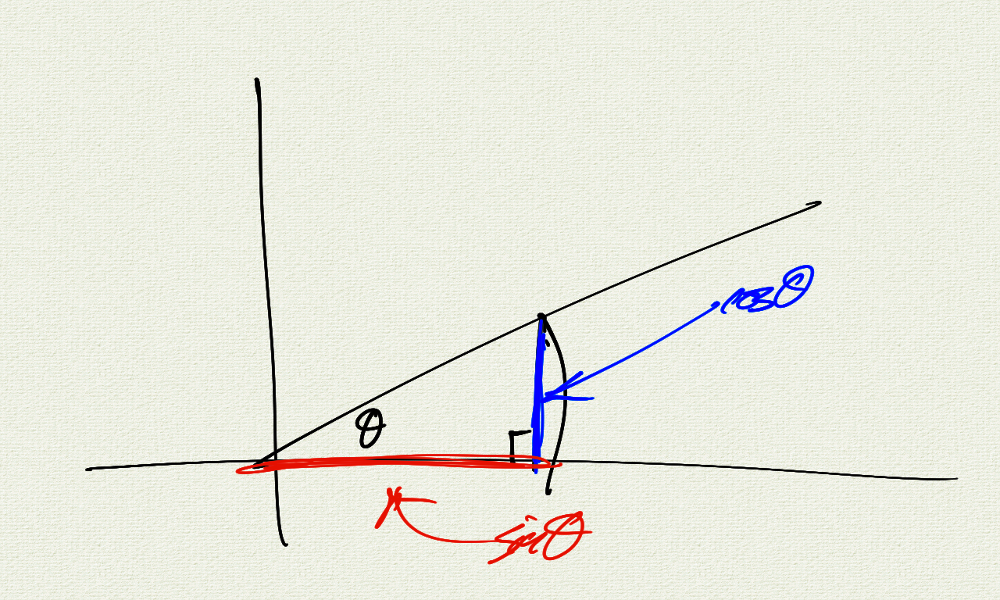
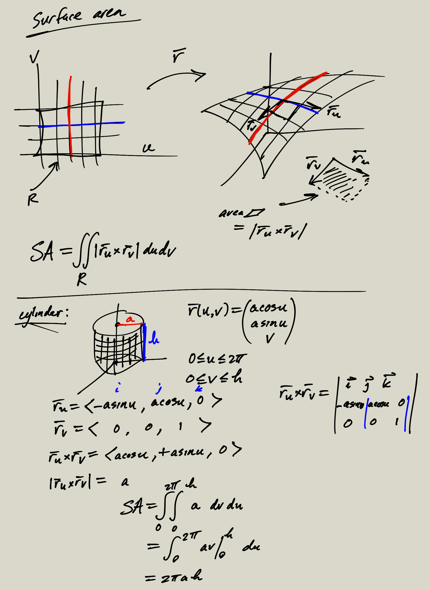

Blah blah blah

```javascript
function f() {
    console.log("Hello, world!");
}
```

Blah blah blah.  Blah blah blah.  Blah blah blah.
Let $f(x) = \cos(x)$. Blah blah blah.

$$ e^x = \sum_{n=0}^\infty \frac{x^n}{n!} $$

Blah blah blah.  Blah blah blah.  Blah blah blah.

$$ \cos^2 x + \sin^2 x = 1 $$

<br/>
<div class="sketch-container" id="pyramidContainer"></div>  
<br/>

```java
public class Hello
{
    public static void main(String[] args)
    {
        System.out.println("Hello, world!");
    }
}
```

<br/>

<div class="sketch-container" id="unitCircleContainer"></div>  

<br/>



```console
# compile
javac Hello.java

# run
java Hello
```

<br/>

<br/>


<script src="unit_circle.js"></script>
<script src="pyramid.js"></script>

<script>
    let unitCircle = new p5(addHandlers(unitCircleSketchMaker), "unitCircleContainer");
    let pyramid = new p5(addHandlers(pyramidSketchMaker), "pyramidContainer");
</script>

