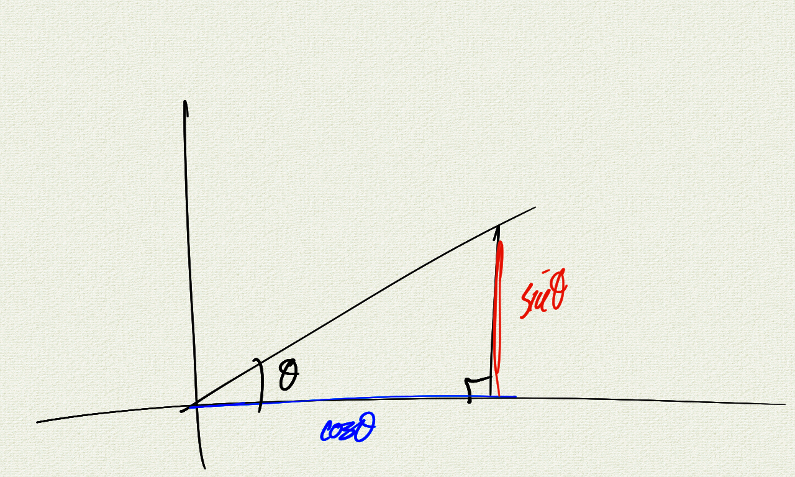

Blah blah blah

```javascript
function f() {
    console.log("Hello, world!");
}
```

$$ e^x = \sum_{n=0}^\infty \frac{x^n}{n!} $$

<br/>
<div class="sketch-container" id="pyramidContainer"></div>  
<br/>

```java
public class Hello
{
    public static void main(String[] args)
    {
        System.out.println("Hello, world!");
    }
}
```

<br/>

<div class="sketch-container" id="unitCircleContainer"></div>  

<br/>



```console
# compile
javac Hello.java

# run
java Hello
```

<br/>

<br/>


<script src="handlers.js"></script>
<script src="unit_circle.js"></script>
<script src="pyramid.js"></script>

<script>
    new p5(unitCircleSketchMaker, "unitCircleContainer");
    new p5(pyramidSketchMaker, "pyramidContainer");
</script>

